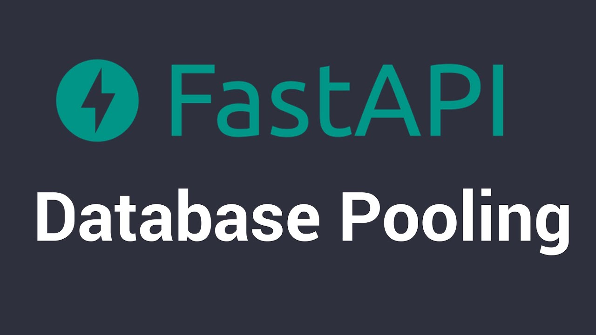
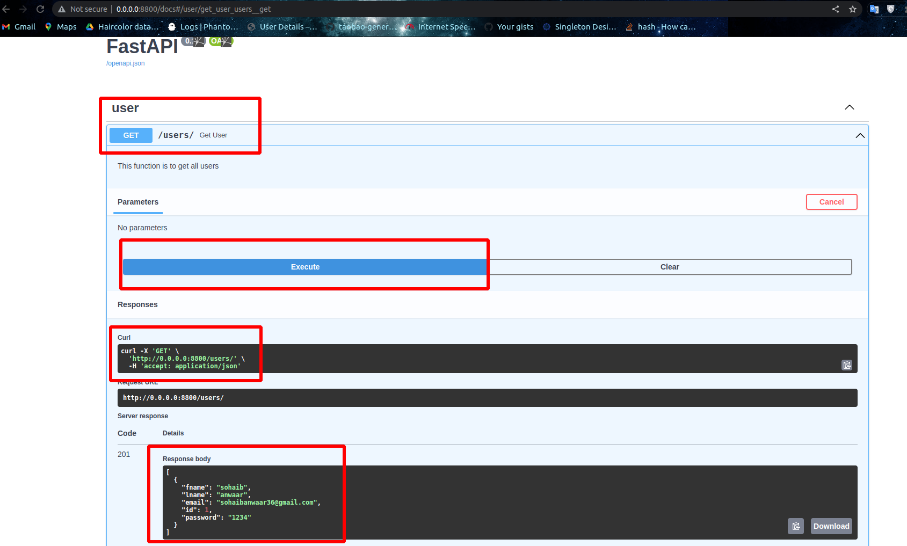

# Fast-API with DB Connection Pools

## Problem Statement
When we are writing a fast-api which is interacting with the database and we got more load on our systems, Where most of the time is taken by the database connection.

### Some common problems with database connections
1. Database connection limit exceeded
2. Database connection timeout
3. Database connection is not closed properly
4. Database connection is not released properly

## Introduction
In this api we will see how to make an api with DB connection pools using FastAPI and SQLAlchemy. So that we can make our application more scalable and efficient.

We will make a user model in Fast api and postgres database. We will use SQLAlchemy as an ORM to interact with the database.

## Requirements
1. Python 3.6+

## Installation
1. Clone the repository
2. Create a virtual environment `conda create -n <env_name> python=3.6`
3. Install the requirements `pip install -r requirements.txt`
4. Run the application `uvicorn main:app --reload`

## Steps
Lets create a user model in `main.py`, In this file we will mention the fast api things, routers,
startup event, shut down event and database connection.

```python
# Imports
from fastapi import FastAPI
from routers.user import view as userview
from database import engine
from connection_pool import database_instance
from fastapi.middleware.cors import CORSMiddleware

# Fast API
app = FastAPI()

origins = ["*"]
# CORS
app.add_middleware(
    CORSMiddleware,
    allow_origins=origins,
    allow_credentials=True,
    allow_methods=["*"],
    allow_headers=["*"],
)

# Including routers
app.include_router(userview.router)

# Start up event
@app.on_event("startup")
async def startup():
    await database_instance.connect()

# Main route
@app.get("/")
async def root():
    return {"message": "CMMS APP"}

```


Lets Make a User model now in `routers/user/models.py`
our model will have id, fname, lname, email, password and we will use SQLAlchemy as an ORM to interact with the database.

```python
from sqlalchemy import Boolean, Column, ForeignKey, Integer, String
from sqlalchemy.orm import relationship
from database import Base

class User(Base):
    __tablename__ = "user"

    id = Column(Integer, primary_key=True, index=True)
    fname = Column(String)
    lname = Column(String)
    email = Column(String)
    password = Column(String)

```

Now we make Serializers for the User model in `routers/user/serializers.py`
this serializer will help us to convert the data from the database to the python object and vice versa.

```python
from dataclasses import Field
from pydantic import BaseModel, EmailStr
from typing import Optional, List
from datetime import datetime
import uuid

class UserBase(BaseModel):
    id: int
    fname: str
    lname: str
    email: EmailStr
    password: str

    class Config:
        orm_mode = True
```

Now we will make a router for user in `routers/user/view.py` file, this file will have all the routes for the user model, which will help us in communicating with the api.

```python
from fastapi import status, HTTPException, Depends, APIRouter
from sqlalchemy.orm import Session
from database import get_db
from typing import Optional, List
from  routers.user.serializer import UserBase
from  routers.user import models
import time
from connection_pool import database_instance

router = APIRouter(
    prefix="/users",
    tags=['user']
)


# GET user
@router.get("/", status_code=status.HTTP_201_CREATED)
async def get_user():
    """ 
    This function is to get all users
    """
    try:
        value = await database_instance.fetch_rows(query="SELECT * FROM public.user")
        return  value
    except Exception as err:
        print(err.args[0])
        raise HTTPException(status_code=status.HTTP_500_INTERNAL_SERVER_ERROR,
                            detail=err.args[0])


# Create User
@router.post("/", status_code=status.HTTP_201_CREATED)
async def create_user(user: UserBase):
    db_user = models.User(**dict(user))
    result = await database_instance.execute(
        query="INSERT INTO public.user (id, fname,lname, email, password) VALUES ('{}', '{}', '{}', '{}', '{}')".format(db_user.id, db_user.fname,db_user.lname, db_user.email, db_user.password))
    if result == "INSERT 0 1":
        return db_user
    else:
        raise HTTPException(status_code=status.HTTP_500_INTERNAL_SERVER_ERROR,
                            detail="Something went wrong")
```

So Our API is ready now, Lets make a database connection pool in `connection_pool.py`

Lets make `.env` file

```bash
DATABASE_HOSTNAME="localhost"
DATABASE_PORT="5432"
DATABASE_PASSWORD="postgres"
DATABASE_NAME="test_fastapi"
DATABASE_USERNAME="postgres"
```

Nows lets make a settings file to read `.env` automatically in `settings.py`

```python
from typing import Optional
from pydantic import BaseSettings

# This is a pydantic model for the enviroment variables
class Settings(BaseSettings):
    database_hostname: str
    database_port: str
    database_password: str
    database_name: str
    database_username: str

    class Config:
        env_file = ".env"


settings = Settings()
```
`connection_pool.py` file will help us to make a connection pool with the database

```python
import asyncpg
# from psycopg2 import pool
from settings import settings


class Database:
    def __init__(self):
        self.user = settings.database_username
        self.password = settings.database_password
        self.host = settings.database_hostname
        self.port = "5432"
        self.database = settings.database_name
        self._cursor = None

        self._connection_pool = None
        self.con = None

    async def connect(self):
        if not self._connection_pool:
            try:
                self._connection_pool = await asyncpg.create_pool(
                    min_size=1,
                    max_size=10,
                    command_timeout=60,
                    host=self.host,
                    port=self.port,
                    user=self.user,
                    password=self.password,
                    database=self.database,
                )

            except Exception as e:
                print(e)

    async def fetch_rows(self, query: str):
        """
        Function to fetch rows from the database
        """
        if not self._connection_pool:
            await self.connect()
        else:
            self.con = await self._connection_pool.acquire()
            try:
                result = await self.con.fetch(query)
                print("Results", result)
                return result
            except Exception as e:
                print(e)
            finally:
                await self._connection_pool.release(self.con)
    # For create quries
    async def execute(self, query: str):
        if not self._connection_pool:
            await self.connect()
        else:
            self.con = await self._connection_pool.acquire()
            try:
                result = await self.con.execute(query)
                print("Results", result)
                return result
            except Exception as e:
                print(e)
            finally:
                await self._connection_pool.release(self.con)

database_instance = Database()
```

Now lets make a table in Postgres database manually
with name user and columns id, fname, lname, email, password

```sql
CREATE TABLE public.user
(
    id integer NOT NULL DEFAULT nextval('user_id_seq'::regclass),
    fname character varying COLLATE pg_catalog."default" NOT NULL,
    lname character varying COLLATE pg_catalog."default" NOT NULL,
    email character varying COLLATE pg_catalog."default" NOT NULL,
    password character varying COLLATE pg_catalog."default" NOT NULL,
    CONSTRAINT user_pkey PRIMARY KEY (id)
)
```

Now lets run our API

```bash
uvicorn main:app --reload
```

Now go to your browser and hit `http://localhost:8000/docs/` and you will see the documentation of your API

```json
[
    {
        "id": 1,
        "fname": "sohaib",
        "lname": "anwaar",
        "email": "sohaibanwaar36@gmail.com"
    }
]
```


## Swagger UI



## Github Repo
https://github.com/SohaibAnwaar/FastApi-SqlAlchemy

# Author

- Sohaib Anwaar : https://www.sohaibanwaar.com
- gmail : sohaibanwaar36@gmail.com
- linkedin : [Have Some Professional Talk here](https://www.linkedin.com/in/sohaib-anwaar-4b7ba1187/)
- Stack Overflow : [Get my help Here](https://stackoverflow.com/users/7959545/sohaib-anwaar)
- Kaggle : [View my master-pieces here](https://www.kaggle.com/sohaibanwaar1203)
- Github : [View my code here](https://github.com/SohaibAnwaar)